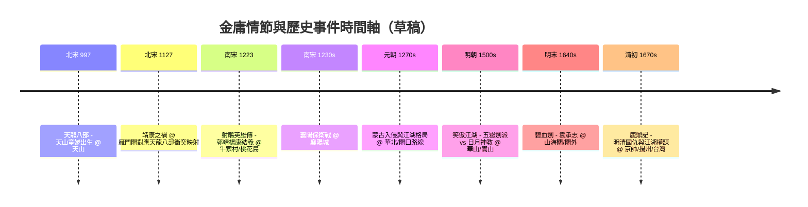

# Brainstorming Session Results

**Facilitator:** {{user_name}}
**Date:** {{date}}

## Session Overview

**Topic:** 以歷史事件對應金庸故事情節的使用體驗設計  
**Goals:** 釐清使用者如何利用歷史事件探索金庸情節，並規劃地圖互動與資料來源策略

### Context Guidance

目前無額外 context 檔案，後續若有外部研究或資料規範，可再補充。

### Session Setup

焦點在使用者旅程：以歷史事件為切入，對應金庸故事時間線與地點，透過互動地圖與可靠資料來源呈現。

## Technique Selection

**Approach:** Progressive Technique Flow  
**Journey Design:** 從發散到收斂，最後落到可執行的 MVP 路線

**Progressive Techniques:**
- **Phase 1 - Exploration：** Crazy 8s + 地圖標註快想（快速產出「歷史事件 × 金庸情節 × 地點」點子）
- **Phase 2 - Pattern Recognition：** Affinity Mapping（將 Phase 1 點子聚類成主題，例如朝代/勢力、武功流派、地理區域、時間線高潮）
- **Phase 3 - Development：** Storyboard / Journey Slice（挑 2-3 條使用者路徑，如按年代/門派/勢力衝突，補齊互動與資料需求）
- **Phase 4 - Action Planning：** Impact/Effort Matrix + MVP 微路線（選 1 條優先路線，列 MVP 功能：時間軸、地點標記、事件卡、維基來源欄位）

**Journey Rationale:** 先大量發散，透過聚類找模式，再把重點路徑深化並收斂成具體 MVP 功能與資料來源清單。

## Technique Execution (Phase 1 - Crazy 8s + 地圖標註快想)

初步 3 組點子（持續追加中）：
- 北宋靖康之禍 × 《天龍八部》情節映射 × 雁門關
- 南宋背景 × 《射鵰英雄傳》保衛襄陽 × 襄陽城
- 元朝勢力/蒙古入侵 × 《倚天屠龍記》江湖格局 × 蒙古進犯路線
- 明朝政教衝突 × 《笑傲江湖》五嶽劍派 vs 日月神教 × 華山/嵩山等門派據點
- 明末亂局 × 《碧血劍》袁承志 × 關外/山海關一帶
- 清初政權 × 《鹿鼎記》明清國仇與江湖權謀 × 京師/揚州/台灣線索

目前累積 6 組，若要滿足 Crazy 8s 可再補 2+ 組；也可直接進入親和圖聚類。

## Idea Organization (Phase 2 - Affinity Mapping)

聚類主題（從 6 組點子整理）：
- **城池/關口防禦線：** 雁門關（靖康之禍×天龍八部）、襄陽城（射鵰保衛）、蒙古進犯路線（倚天）；聚焦戰事與防線視覺化。
- **朝代政權與亂局：** 北宋靖康、南宋抗金、元朝統治/蒙古入侵、明末亂局、清初易代；對應武俠江湖在政權更替下的選邊與生存。
- **江湖門派與勢力衝突：** 五嶽劍派 vs 日月神教（明朝）、江湖勢力在明清國仇中的站隊（鹿鼎記）、袁承志在明末的雙線（朝廷亂局＋江湖義理）。
- **民族／國仇軸線：** 金宋衝突、蒙古入侵、明清易代；可以時間軸 + 勢力勢圖呈現。

候選視覺路徑：
- 時間軸 × 地圖熱點：依年代滑動，顯示事件節點與對應情節卡。
- 勢力/門派圖層：切換顯示朝廷 vs 江湖、門派分布與衝突線。
- 戰事路徑：如蒙古入侵路徑、襄陽圍城、關口防線（雁門、山海關）。

建議下一步：挑 2-3 條主題路徑進入 Storyboard/Journey Slice（Phase 3）。

## Mermaid 時間軸草稿（歷史年份 × 事件 × 金庸情節）

說明：
- 997、1127、1223 等節點取自金庸編年史試算表資料（供 Crazy 8s 發散用）。
- 地點欄位可用於地圖標記與事件卡；後續可在時間軸滑動時同步高亮地圖與情節摘要。

**擴展需求（Phase 4 規劃）：**
- **完整資料匯入：** 將 [Google Sheets 編年史](https://docs.google.com/spreadsheets/d/1fNLRzHZpZ7oYAzgsuEOc1-5A8JBc4jxr5Zlr0rAgjJg/edit?gid=1649231089#gid=1649231089) 中的所有事件（從春秋前476年到清初）全部匯入時間流程表
- **資料結構：** 包含欄位：參考進入時間點、朝代、西元年、月、日、小說、事件、備註、資料來源
- **時間軸完整度：** 從越女劍（前476年）到鹿鼎記（清初），涵蓋所有金庸作品的時間節點
- **實作考量：** 需要設計資料匯入機制（CSV/JSON 匯出或 API 整合），並處理大量資料點的視覺化效能

## Idea Development (Phase 3 - Storyboard / Journey Slice)

### 路徑 1：時間軸 × 地圖熱點（依年代滑動探索）

**使用者進入點：**
- 從首頁選擇「時間軸模式」或直接看到預設的歷史時間軸（如 997-1670s）

**旅程步驟：**

1. **初始視圖（時間軸 + 地圖）**
   - **視覺：** 上方橫向時間軸（可拖曳），下方互動地圖（Old Maps Online 風格）
   - **互動：** 時間軸預設停在某個年代（如 1223 南宋），地圖自動高亮該年代相關地點
   - **資料需求：** 年份、朝代、事件、地點座標、對應小說、情節摘要

2. **滑動時間軸**
   - **互動：** 使用者拖曳時間軸，地圖即時更新標記點
   - **視覺回饋：** 地圖上的標記點依年代淡入淡出，當前年代的事件點高亮
   - **資料需求：** 時間序列資料（從試算表匯入）

3. **點擊地圖標記**
   - **互動：** 點擊地圖上的標記（如「襄陽城」），右側或下方彈出事件卡
   - **事件卡內容：**
     - 歷史事件：襄陽保衛戰（1230s）
     - 對應小說：射鵰英雄傳
     - 情節摘要：郭靖黃蓉保衛襄陽
     - 相關人物：郭靖、黃蓉、蒙古大軍
     - 資料來源：維基百科連結
   - **資料需求：** 事件描述、小說章節引用、人物清單、維基連結

4. **深入探索**
   - **互動：** 事件卡可展開查看更多細節，或連結到相關事件
   - **視覺：** 相關事件在地圖上用虛線連接，形成事件網絡
   - **資料需求：** 事件關聯性資料、章節內容摘要

**痛點與解決：**
- 痛點：時間軸跨度大，地圖標記可能過多
- 解決：提供篩選器（依小說、朝代、事件類型），或分層顯示（先顯示主要事件）

---

### 路徑 2：勢力/門派圖層（切換顯示朝廷 vs 江湖）

**使用者進入點：**
- 從首頁選擇「勢力模式」或「門派模式」

**旅程步驟：**

1. **選擇圖層類型**
   - **互動：** 切換按鈕：朝廷勢力 / 江湖門派 / 兩者疊加
   - **視覺：** 地圖上以不同顏色標示勢力範圍或門派據點

2. **朝廷勢力圖層**
   - **視覺呈現：**
     - 北宋（藍色）、南宋（淺藍）、金（橙色）、蒙古/元（紅色）、明（黃色）、清（紫色）
     - 勢力邊界用虛線標示，重要城池標記
   - **互動：** 點擊勢力區域，顯示該朝代的統治範圍、重要歷史事件、對應金庸情節
   - **資料需求：** 朝代疆域資料、歷史事件、對應小說情節

3. **江湖門派圖層**
   - **視覺呈現：**
     - 門派據點用圖標標記（如華山派、嵩山派、日月神教）
     - 門派間衝突用箭頭或連線表示
     - 門派勢力範圍用半透明色塊覆蓋
   - **互動：** 
     - 點擊門派圖標，顯示門派資訊（創立時間、主要人物、武功特色）
     - 點擊衝突線，顯示衝突事件與對應小說章節
   - **資料需求：** 門派清單、據點座標、人物關係、衝突事件

4. **疊加模式**
   - **視覺：** 同時顯示朝廷勢力與江湖門派，用不同圖層透明度區分
   - **互動：** 可調整各圖層透明度，觀察政權與江湖的互動關係
   - **洞察：** 例如「明朝時期，五嶽劍派與日月神教的衝突如何與朝廷政策相關」

**痛點與解決：**
- 痛點：圖層資訊過多可能造成視覺混亂
- 解決：提供圖層開關、透明度調整、區域縮放功能

---

### 路徑 3：戰事路徑（蒙古入侵、襄陽圍城、關口防線）

**使用者進入點：**
- 從首頁選擇「戰事模式」或直接點擊「蒙古入侵」等戰役卡片

**旅程步驟：**

1. **選擇戰役**
   - **互動：** 戰役列表（蒙古入侵、襄陽保衛戰、雁門關事件等）
   - **視覺：** 每個戰役卡片顯示時間、地點、對應小說

2. **戰役路徑視覺化**
   - **視覺呈現：**
     - 地圖上顯示進軍路線（箭頭動畫或靜態路徑線）
     - 重要據點標記（起點、中繼點、終點）
     - 時間標註（如「1223年6月 郭靖楊康結義 @ 牛家村」）
   - **互動：** 
     - 沿路徑點擊，顯示該地點的歷史事件與小說情節
     - 時間軸同步顯示戰役進程

3. **關口防線模式**
   - **視覺：** 重點關口（雁門關、山海關、襄陽城）用特殊圖標標記
   - **互動：** 點擊關口，顯示：
     - 歷史重要性（為何是戰略要地）
     - 對應小說情節（如雁門關與天龍八部的關聯）
     - 防禦線示意圖
   - **資料需求：** 關口地理資訊、歷史戰役、小說情節對應

4. **戰役時間線**
   - **視覺：** 戰役專屬時間軸，顯示關鍵時間點
   - **互動：** 時間軸與地圖同步，可看到戰役在不同時間點的地理位置
   - **資料需求：** 戰役時間序列、地點序列、事件描述

**痛點與解決：**
- 痛點：戰役路徑可能跨越多個朝代，時間軸複雜
- 解決：提供戰役專屬視圖，聚焦單一戰役的時間與地理脈絡

---

### 資料來源需求總結

**核心資料：**
1. **時間序列資料：** 從 Google Sheets 匯入（年份、朝代、月、日、事件、小說、地點）
2. **地理座標：** 歷史地點的現代座標或古代地圖座標
3. **小說情節摘要：** 對應章節、人物、情節描述
4. **維基百科連結：** 歷史事件與小說條目的連結

**進階資料：**
1. **勢力疆域資料：** 各朝代的疆域邊界（GeoJSON 格式）
2. **門派據點：** 門派名稱、據點座標、創立時間、主要人物
3. **戰役路徑：** 進軍路線的座標序列
4. **事件關聯性：** 事件之間的關聯（如「襄陽保衛戰」與「郭靖楊康結義」的時序關係）

**資料來源策略：**
- **主要來源：** Google Sheets 編年史（已提供）
- **補充來源：** 維基百科 API、OpenStreetMap（地理資料）、歷史地圖資料庫

## Action Planning (Phase 4 - Impact/Effort Matrix + MVP 微路線)

### Impact/Effort 評估

**路徑 1：時間軸 × 地圖熱點**
- **Impact（影響力）：** ⭐⭐⭐⭐⭐ 高 - 核心功能，使用者最直觀的探索方式
- **Effort（開發成本）：** ⭐⭐⭐ 中 - 需要時間軸元件、地圖整合、資料同步邏輯
- **使用者價值：** 最高 - 符合「依年代探索」的核心需求
- **技術複雜度：** 中 - 時間軸與地圖的即時同步需要狀態管理

**路徑 2：勢力/門派圖層**
- **Impact（影響力）：** ⭐⭐⭐⭐ 中高 - 提供深度分析視角
- **Effort（開發成本）：** ⭐⭐⭐⭐ 中高 - 需要圖層系統、疆域資料、門派資料庫
- **使用者價值：** 中高 - 進階使用者會喜歡，但非核心需求
- **技術複雜度：** 高 - 需要處理多圖層、透明度、複雜的資料結構

**路徑 3：戰事路徑**
- **Impact（影響力）：** ⭐⭐⭐ 中 - 特定場景的深入探索
- **Effort（開發成本）：** ⭐⭐⭐⭐ 中高 - 需要路徑視覺化、戰役資料、動畫效果
- **使用者價值：** 中 - 對特定戰役有興趣的使用者
- **技術複雜度：** 中高 - 路徑動畫與時間序列同步

### 優先路線選擇：**路徑 1 - 時間軸 × 地圖熱點**

**選擇理由：**
1. **最高 Impact：** 符合核心需求「透過歷史事件對應金庸情節」
2. **最佳 MVP 起點：** 可以快速驗證核心概念
3. **可擴展性：** 後續可在此基礎上加入圖層、戰役等功能
4. **資料完整度：** 可直接使用 Google Sheets 的完整編年史資料

---

### MVP 功能清單（路徑 1 優先）

#### 核心功能（Must Have）

1. **時間軸元件**
   - 橫向可拖曳時間軸
   - 時間範圍：前476年（越女劍）到 1670s（鹿鼎記）
   - 時間標記點（年份、朝代標籤）
   - **資料來源：** Google Sheets 編年史（完整匯入所有事件）

2. **互動地圖**
   - Old Maps Online 風格的歷史地圖底圖
   - 地圖標記點（對應時間軸當前年代的事件地點）
   - 標記點點擊互動
   - **資料需求：** 地點座標（從 Google Sheets 或地理資料庫取得）

3. **事件卡片**
   - 點擊地圖標記時顯示
   - 內容包含：
     - 歷史事件名稱
     - 時間（年、月、日）
     - 朝代
     - 對應小說
     - 情節摘要
     - 相關人物
     - 資料來源連結（維基百科）
   - **資料來源：** Google Sheets + 維基百科 API

4. **資料匯入機制**
   - Google Sheets 資料匯入（CSV/JSON 格式）
   - 資料欄位對應：參考進入時間點、朝代、西元年、月、日、小說、事件、備註、資料來源
   - 資料驗證與清理
   - **實作方式：** 定期匯出或 API 整合

5. **時間軸與地圖同步**
   - 拖曳時間軸時，地圖即時更新標記點
   - 當前年代的事件點高亮顯示
   - 其他年代的事件點淡出或隱藏

#### 進階功能（Should Have - MVP 後續版本）

6. **篩選器**
   - 依小說篩選（天龍八部、射鵰英雄傳等）
   - 依朝代篩選（北宋、南宋、元朝等）
   - 依事件類型篩選（出生、戰役、結義等）

7. **搜尋功能**
   - 搜尋事件名稱
   - 搜尋人物名稱
   - 搜尋地點名稱

8. **事件關聯視覺化**
   - 相關事件用虛線連接
   - 點擊事件可查看關聯事件

#### 未來功能（Nice to Have）

9. **勢力/門派圖層**（路徑 2）
10. **戰事路徑視覺化**（路徑 3）
11. **使用者書籤/收藏**
12. **分享功能**

---

### MVP 技術架構建議

**前端：**
- 地圖庫：Leaflet 或 Mapbox（支援歷史地圖底圖）
- 時間軸元件：自訂或使用 Timeline.js
- 框架：React/Vue（狀態管理用於時間軸與地圖同步）

**資料處理：**
- Google Sheets API 或 CSV 匯入
- 資料轉換：將試算表資料轉為 JSON 格式
- 地理編碼：將地點名稱轉為座標（使用 OpenStreetMap 或 Google Geocoding API）

**資料儲存：**
- 靜態 JSON 檔案（初期）
- 後續可考慮資料庫（如 SQLite 或 PostgreSQL）

---

### MVP 開發優先順序

**Sprint 1（核心功能）：**
1. 資料匯入機制（Google Sheets → JSON）
2. 時間軸元件（基本拖曳功能）
3. 地圖整合（基本標記顯示）

**Sprint 2（互動功能）：**
4. 時間軸與地圖同步
5. 事件卡片（點擊標記顯示）
6. 資料來源連結

**Sprint 3（優化與擴展）：**
7. 篩選器功能
8. 搜尋功能
9. 效能優化（大量資料點的渲染優化）

---

### 成功指標（MVP 驗證）

1. **功能完整性：** 使用者可以透過時間軸探索所有金庸作品的事件
2. **資料完整度：** 成功匯入 Google Sheets 中的所有事件（100+ 事件）
3. **使用者體驗：** 時間軸與地圖同步流暢，無明顯延遲
4. **資料準確性：** 事件卡片資訊正確，維基百科連結有效

---

### 下一步行動

1. **資料準備：** 從 Google Sheets 匯出完整資料，轉換為 JSON 格式
2. **技術選型：** 確定前端框架與地圖庫
3. **原型開發：** 建立時間軸與地圖的基本整合
4. **資料驗證：** 確認所有事件的座標與資訊完整性

