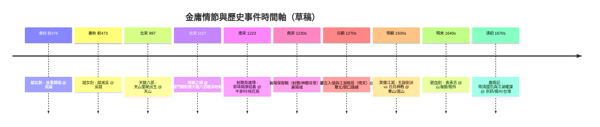

以下時間軸節點取自金庸編年史試算表，結合歷史年份、事件與對應情節，供後續地圖標記與時間軸互動使用。

> 資料來源整理自試算表（[連結](https://docs.google.com/spreadsheets/d/1fNLRzHZpZ7oYAzgsuEOc1-5A8JBc4jxr5Zlr0rAgjJg/edit?gid=1649231089#gid=1649231089)），時間點與情節對應僅供草稿，可在後續 Storyboard/Journey Slice 階段再細化。

